# Proyecto I - WikiSearch

## Tecnológico de Costa Rica

## Escuela de Ingeniería en Computación

## Bases de Datos II (IC 4302)

## Integrantes del grupo

- José Ricardo Cardona Quesada    | Carné: 2021022613
- Joctan Antonio Porras Esquivel  | Carné: 2021069671
- Justin Gilberto Acuña Barrantes | Carné: 2018093451

## Profesor

- Gerardo Nereo Campos Araya

## Segundo Semestre 2023

La presente es la documentación del proyecto 1 , que consistió en desarrollar un sistema para desplegar y procesar páginas de wikipedia a través de los Wikidumps XML. En este documento se detalla la funcionalidad de los componentes implementados, las pruebas unitarias realizadas, el manual de usuario para operar el sistema, y las conclusiones y recomendaciones para mejoras futuras. El objetivo es proporcionar una visión integral de la solución desarrollada y sus capacidades

## Infraestructura Propuesta para las Bases Utilizadas

### Autonomous Database

Para mantener una buena consistencia de los datos, para nuestra base SQL en oracle, el modelo propuesto es:

#### Tablas y datos importantes

- La **tabla File** almacena metadatos de los archivos de los Wiki Dumps, cuyos datos ya han sido procesados por el loader. Cada archivo tiene un ID único y un nombre. Esta tabla es relevante ya que a través de la información contenida aquí se puede revisar si ya los datos de una página fueron ingresados a la base anteriormente y así evitar que el Loader los ingrese por segunda vez.

- La **tabla Site** modela los datos del sitio, base de datos y lenguaje asociado a un File. Cada sitio tiene un ID, hace referencia al archivo de la tabla File a quien le pertenecen esos datos, y tiene campos para el nombre del sitio, base de datos, idioma, etc.

- La **tabla Page** contiene todas  las páginas de Wikipedia que se han procesado de los distintos archivos. Tiene campos como el ID, referencia al sitio al que pertenece, namespace, título, etc. Un atributo relevante es el de RATING, ya que este no se determina a partir de los wikidumps. Este atributo se modifica por medio del sistema de votación que se solicita para la UI, Este valor empieza como 0 y dependiendo de si recibe votaciones a favor o en contra aumenta o disminuye.

- La **tabla LastRevision** almacena los metadatos de la última revisión de cada página: ID, usuario que hizo la edición, texto completo de la revisión, bytes, fecha, etc. Hace referencia a la página de la cual es revisión.  Para extraer el texto de una página es necesario hacer un join entre una página y los datos que se encuentran en esta tabla.

- La **tabla Restriction** almacena información sobre las restricciones/protecciones que pueden tener las páginas. Cada restricción tiene un ID y un enlace con más detalles.  Es importante aclarar que una restricción puede aparecer en muchas páginas, y asimismo, una página puede tener muchas restricciones. Por lo tanto es necesario una tabla intermediaria.

- **PageXRestrictions** es una tabla intermedia para modelar la relación muchos a muchos entre páginas y restricciones. En esta tabla se contienen los ids de las distintas restricciones que existen y se asocian a páginas.

- La **tabla Link** almacena los distintos enlaces que aparecen en las páginas. Cada enlace tiene un ID y la URL del enlace. Al igual que con las restricciones, los links pueden pertenecer a muchas páginas y una página puede tener muchos links. Por lo tanto, también se ocupa una tabla intermedia.

- **PageXLink** es  la tabla intermedia para la relación muchos a muchos entre páginas y links.

#### Aclaración Importante del modelo

Para seguir los principios de normalización se tomó la decisión de  no almacenar datos que pueden calcularse a partir de otros datos en la base de datos. En este caso los datos que no se incluyeron en las tablas fueron:

- PageNumberLinks este se calcula usando la cantidad de links asociados a una página.

- PageHasRedirect se calcula revisando si el atributo Redirect es distinto de NULL en la tabla LastRevision.

#### Indices de Búsqueda

[//]: # (Poner el nombre de cada índice y explicar para qué sirve)

#### Stored Procedures Incluidos

##### INSERT_PAGE_ALL

El objetivo de este procedimiento es agregar una instancia a la tabla página junto con los datos de su última revisión. Se reciben todos los datos para una entrada en la tabla page excepto el parámetro rating. El método está hecho para funcionar en el loader en conjunto con los métodos INSERT_RESTRICTION e  INSERT_LINK. Estos tres se encargan de ingresar todos los datos de una página de wikipedia a la base de datos.

##### INSERT_LINK

Este método ingresa individualmente los datos de un Link a su tabla respectiva, aparte de esto conecta el link a una página en la tabla PageXLink. Esto para posteriormente poder obtener todos los links asociados a una página. Importante recalcar que el método está planeado para llamarse múltiples veces por cada link que tenga una página. Este ciclo de llamadas se implementa dentro del Loader.

##### INSERT_RESTRICTION

##### INSERT_FILE

Este procedimiento simplemente recibe el nombre de un archivo que se va a procesar en la base de datos, esto para tener un registro de los datos que ya se han ingresado a la base. El método se utiliza dentro del Loader para verificar si se ocupa procesar un archivo en el bucket e ingresarlo a las base.

##### GET_FILENAMES

Este método ingresa a la tabla File y revisa todos los nombres de los archivos que se han procesado en la base y los regresa en forma de un cursor. Una vez en el loader este cursor se puede procesar y convertir en una lista con los nombres.

##### INSERT_SITE

Este método inserta los datos del sitio que aparece en un archivo específico de la tabla File, por lo tanto de parámetro se recibe el Id del File al que pertenece, junto con los datos que se quieren ingresar.

##### BUSCAQUEDAGENERAL

[//]: # (Explicar que hace el procedimiento)

### MongoDb Mapping

[//]: # (Poner una Imagen del Mapping en Mongo, Porfa alguien que explique esto, <== ayuden a este pobre hombre José)

## Componentes del Proyecto

### Object Storage

Para el componente Object Storage las indicaciones del proyecto dicen que se deben de subir 3 archivos para cada procesamiento de las páginas en el loader, estos son:

- enwiki-latest-pages-articles-multistream*.xml-p\*p\*.bz2

- enwikilatest-abstract*.xml.gz

- enwiki-latest-pages-articles-multistream-index*.txt-p\*p\*.bz2

También se menciona que estos archivos serán manualmente descargados, descomprimidos y subidos dentro de Object Storage.
Para el proyecto implementamos esto de forma mucho más eficiente. Las mejoras que hicimos se dividen en dos:

- **No hace falta descomprimir los datos primero para subirlos:**

Para evitar gastar más espacio del necesario en el ambiente local donde se suben los datos y para que sea más rápido el proceso de subir los datos al bucket, optamos por implementar dentro del loader una función que recibe un archivo comprimido tipo bz2 y fácilmente extrae sus datos. Esto evita tener que descomprimir los datos antes de subirlos al bucket.

- **Solo ocupamos un archivo para todos los datos**

Las instrucciones del proyecto indican que para obtener los atributos PageWikipediaLink y PageLinks debíamos utilizar los archivos "enwiki-latest-abstract*.xml.gz" o "enwiki-latest-pages-articlesmultistream-index*.txt-pp.bz2".
Sin embargo, nosotros logramos obtener estos datos a través del archivo "enwiki-latest-pages-articlesmultistream" utilizando la librería mwParserfromhell para parsear el wikitext y extraer estos elementos. Esto es posible gracias a que el wikitext de cada página de Wikipedia contiene los links hacia otras páginas de Wikipedia, y por lo tanto parseando solo los links se puede armar una lista con todos estos.

Para esto nos basamos en los ejemplos de la documentación de Mwparser fromhell que se encuentra en:

Por lo tanto para el funcionamiento correcto de todo el programa, solamente es necesario descargar el archivo comprimido  enwiki-latest-pages-articlesmultistream. para las páginas que se quieran procesar y se sube directamente al bucket, sin tener que descomprimir o subir otros archivos.

### DataLoader

Este componente está 100% funcional de acuerdo con lo solicitado en el proyecto, algunas aclaraciones importantes sobre este elemento son:

[//]: # (Incluir que se puede setear una cantidad específica de archivos a procesar y enseñar el código)

### Pruebas realizadas (UnitTests)

#### API

[//]: # (Breve explicación, aclaraciones, explicar cada una de las direcciones  Documentación de los endpoints de Mongo Atlas utilizados, se debe apoyar con ejemplos de su código Pruebas realizadas UnitTests)

### Manual de Instalación / Ejecución

El siguiente será un manual donde se explica la instalación del programa y el uso de la interfaz de usuario.

#### Ejecución

Aqui va la explicacion

#### UI

## Primer pantalla

En la primer pantalla de la aplicación se observará recuadro en el centro con la leyenda "Login WikiSearch". En esta parte se deben de poner las credenciales de acceso a para poder ingresar a realizar las búsquedas.

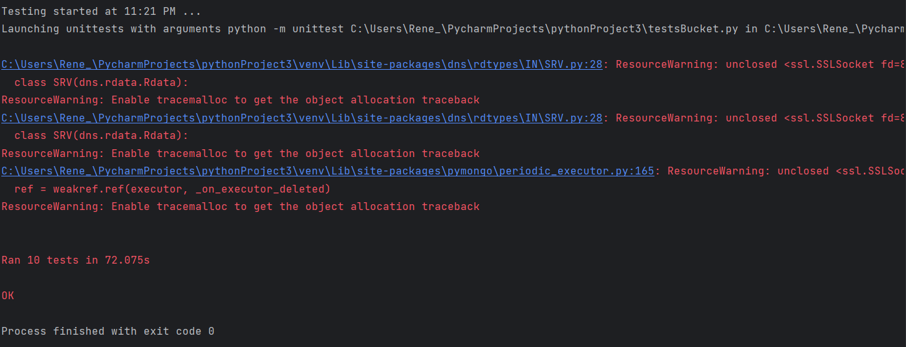

En caso de que se intente entrar con las credenciales vacias o alguna de ellas vacia, la aplicación le mostrará los errores correspondientes:

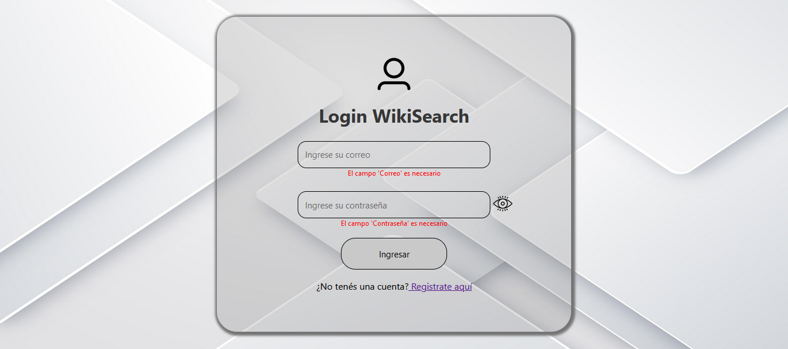

Si no se tiene una cuenta y se intenta entrar con credenciales no válidas, se obtendrá el mensaje correspondientes:

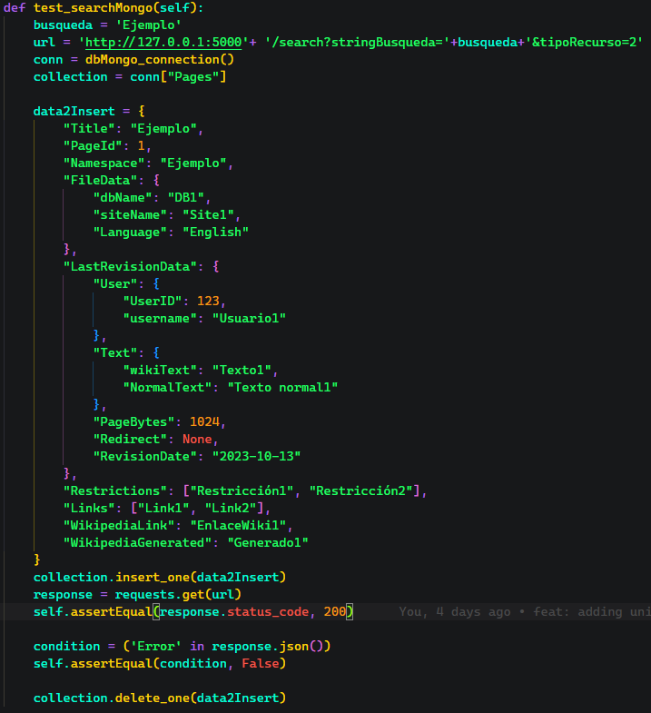

Mensaje de usuario no encontrado:

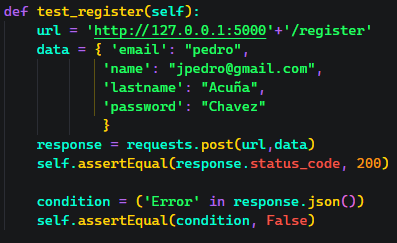

**Nota:** Al tocar el ojo que está al lado del espacio de la contraseña se podrá ver lo que se escribió y al tocarlo de nuevo volverá a estar oculto:

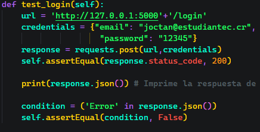

**Importante:** Cuando no se tiene una cuenta se debe ir a la parte de abajo donde dice "Registrate aquí" en azul. Al hacer clic sobre este texto azul se redirigirá a lapantalla de registro que será explicada adelante.

Cuando el usuario y contraseña son válidos, la aplicación lo redirigirá a la pantalla de búsqueda que se explicará más adelante.

## Pantalla de registro

En esta pantalla se tendrá lo siguiente una vez que se entre:

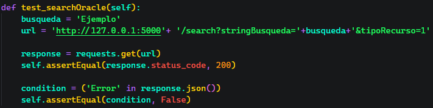

Una vez en esta pantalla se podrá realizar el registro al llenar los datos que se solicitan, pero si un dato está vacio se obtendrá el error correspondiente:

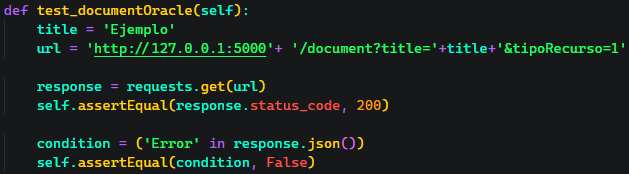

Una vez que se llenen los datos de manera correcta se debe de ver algo así:

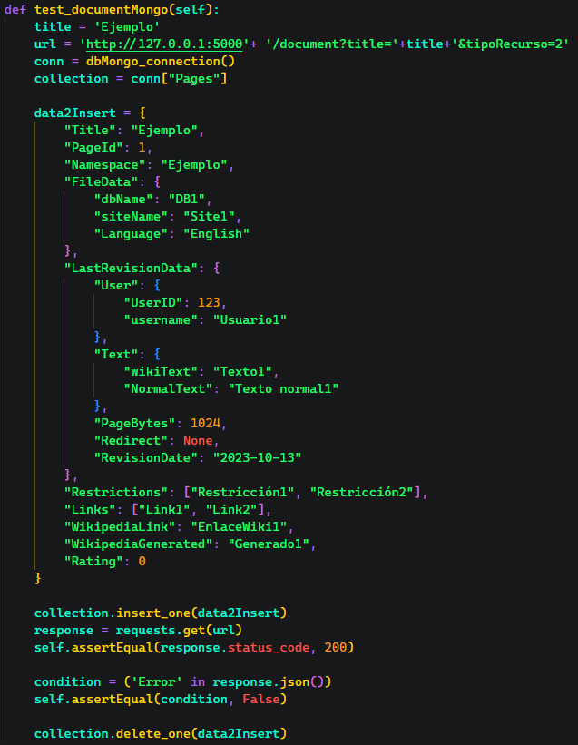

Una vez todo esté listo se debe dar clic sobre el boton que dice "Confirmar", al tener toda la información y dar clic, se recibirá el siguiente mensaje:

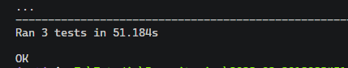

Al dar clic sobre Aceptar, será redireccionado a la pantalla de Login.

## Pantalla Buscar

En esta pantalla se tendrá lo siguiente una vez que se entre:

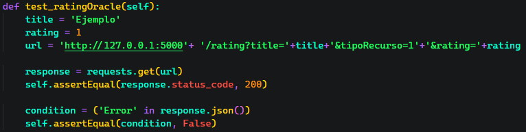

En esta pantalla se cuenta con los siguientes elementos:

- **Barra de búsqueda:** En ella se debe escribir lo que se desea buscar.
- **Botón de Buscar:** Se usa para realizar la búsqueda deseada, si se presiona la tecla ENTER/INTRO se puede obtener el mismo resultado.
- **Botones de tipo de base de datos:** Selecciona la base de datos en la que se quiere realizar la búsqueda.

Si se realiza una búsqueda con la barra vacía se mostrará el siguiente error:

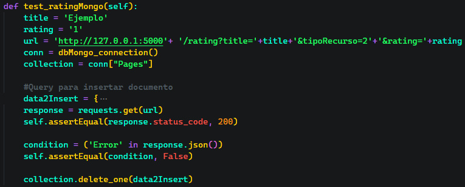

Para seguir buscando solo se presiona aceptar.

Si se realiza una búsqueda y no hay se encuentran coincidencias con lo que se está buscando se mostrará el siguiente mensaje:

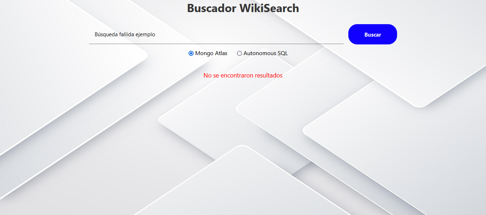

### Página buscar con resultados

Cuando la búsqueda si encuentra algo, se mostrará de la siguiente manera:

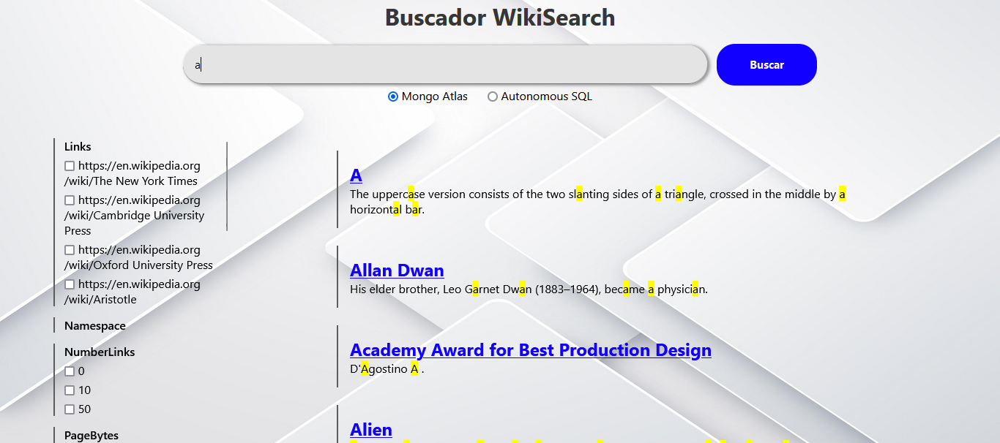

En esta parte tendremos la columna izquierda la cual corresponde a los facets de cada documento. Sin embargo **la funcionalidad de buscar mediante ellos será implementada en futuras versiones de la aplicación**.

La segunda parte es la de los documentos, en esta parte estarán todos los documentos/articulos encontrados, en caso de encontrar muchos articulos, se podrá hacer scroll hasta el final.

Una vez se encuentre el articulo deseado, se puede dar clic sobre el titulo del documento (texto en azul). Esto lo llevará a la siguiente pantalla la cual es la del documento completo.

## Pantalla Documento completo

Para mostrar esta pantalla usaremos la palabra "Anarchism", la pantalla se mostrará de la siguiente manera:

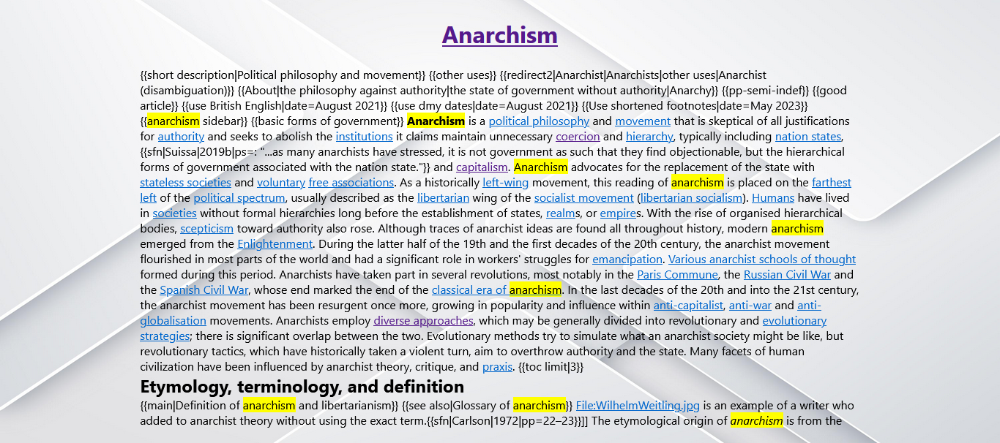

## Final

Esta sería la guía para el uso de la página WikiSearch. Cualquier error o inconveniente, favor comunirlo a cualquiera de los correos:

- [joctan@estudiantec.cr](mailto:joctan@estudiantec.cr)
- [justingilberto@estudiantec.cr](mailto:justingilberto@estudiantec.cr)
- [jcardonar@estudiantec.cr](mailto:jcardonar@estudiantec.cr)

## Recomendaciones

Siempre documentar apropiadamente el código con comentarios explicativos y hacer unit tests que validen cada componente. De esta forma se facilita enormemente la lectura y depuración del código, tanto para uno mismo como para otros miembros del equipo

En lugar de implementar las bases de datos de forma local usando tecnologías como Kubernetes o Docker Compose, recomendamos crear  la infraestructura a la nube, en una plataforma como Oracle Cloud Infrastructure. Al utilizar recursos en la nube como instancias o máquinas virtuales, no es necesario contar con dispositivos locales poderosos o con mucho almacenamiento para los ejecutables o la base de datos.

Siempre usar github y guardar versiones periódicamente, esto para evitar perder datos o recuperar código funcional en caso de que algún componente deje de funcionar.

Para cualquier persona que quiera implementar Oracle Autonomous Database, recomendamos dedicarle tiempo a aprender la sintaxis y estructuras de PL/SQL. Inicialmente, nosotros tuvimos dificultades con este lenguaje, especialmente con tipos de datos como CLOB. y VARRAY.

Estudiar ejemplos prácticos de PL/SQL y revisar documentación de referencia como la [guía oficial de Oracle](https://docs.oracle.com/en/database/oracle/oracle-database/19/lnpls/index.html) es de gran ayuda para dominar este lenguaje.

La comunicación entre el frontend y el backend puede resultar engorrosa en algunos casos. Específicamente, la integración entre React y Flask utilizando sus funciones nativas para HTTP requests puede volverse complicada.
Para facilitar esta integración, recomendamos utilizar la biblioteca Axios de JavaScript. Para aprender sintaxis y uso, se puede hacer desde su [página oficial](https://axios-http.com/docs/intro).

Para procesar los XML dumps de Wikipedia recomendamos usar **mwxml** y **mwparserfromhell**. Estas dos bibliotecas permiten obtener fácilmente la información de cada página dentro del dump, sin tener que lidiar directamente con la complejidad del XML o el wikitext.

Se recomienda establecer una cuenta de Oracle para todo el equipo desde el inicio del proyecto. Todos los miembros del equipo deben conocer y utilizar estas credenciales compartidas. Esto evita inconsistencias y problemas de acceso más adelante.

Distribuir claramente las responsabilidades de cada miembro del equipo. Asignar tareas específicas de desarrollo de base de datos, pruebas, documentación, etc. a diferentes personas. Tener claro quien se encarga de qué.

Recomendamos atomizar las funciones dentro de los componentes, descomponiéndolas en operaciones simples y con propósitos específicos. Evitar funciones muy complejas o que realicen múltiples tareas. Esto es para que luego si sucede algún error dentro de una función no sea tan confuso el proceso de debugging y se pueda entender el problema más fácilmente

Desarrollar y probar componentes individuales del código sin Docker inicialmente. Una vez que cada módulo funcione correctamente de forma aislada, entonces proceder a dockerizar las aplicaciones.

## Conclusiones

- Oracle Db, a pesar de ser una herramienta muy sólida para cloud computing, no es la más sencilla de comprender para principiantes, especialmente en aspectos como la implementación de protocolos de seguridad, el manejo de llaves y restricciones de IP, entre otros. Es necesario tener en cuenta muchos factores para usarla correctamente. Sobre todo cuando se trata de interactuar con la base de datos y su particular lenguaje SQL, ya que en este lenguaje hay tipos especiales como CLOB, VARRAY, etc.

- Para crear la infraestructura de una base de datos o sistema, Terraform es una herramienta sumamente útil. La provisión automática de bases de datos a través de OCI y Terraform convirtió un proceso complejo, donde cada estructura como la DB, los buckets, las instancias, etc. eran creadas manualmente, en algo simple y rápido. Esto nos permitió desplegar instancias rápidamente sin tener que administrar toda la infraestructura.

- Durante la ejecución del proyecto aprendimos que los buckets de Oracle Cloud Infrastructure son sumamente útiles y versátiles para el almacenamiento y acceso a archivos en la nube. Esto ya que permiten cargar fácilmente documentos de todo tipo y descargarlos cuando sea necesario desde cualquier dispositivo o aplicación, evitando tener que almacenar localmente grandes volúmenes de datos.

- Es importante comunicarse entre las partes de UI, API y Loader debido a que se deben establecer estándares en los datos que se van a recibir/enviar para poder trabajar de forma descentralizada y no ser tan dependientes, sin embargo, con algún cambio que surja en el formato se debe comunicar a las partes involucradas para hacer las correcciones necesarias y poder tener todo a tiempo.

- Tener datos de prueba, dummies o tontos hace más sencillo y rápido el desarrollo del UI debido a que se tiene una base de donde partir para poder hacer las funciones y todo lo necesario para recibir los datos una vez que ya están los reales.

- Algunas bases de datos hacen que las tareas de crear, obtener, modificar datos, y obtener conexiones a las bases de datos sean más sencillas, por ejemplo Mongo Atlas, Firebase facilitan las conexiones ya que tienen código generado para varios lenguajes. Además sus estructuras son mucho más intuitivas al ser NoSQL. Caso contrario con Autonomous DB.

- Las máquinas virtuales en la nube son herramientas increíblemente poderosas en comparación con soluciones locales como Docker. Anteriormente, utilizamos Docker y almacenamos todos los datos localmente, lo cual resultaba muy pesado y consumía grandes cantidades de recursos en nuestros dispositivos. Ahora con VMs se resolvieron estos problemas al permitirnos crear entornos aislados y escalables bajo demanda

## Información Importante y Consideraciones

[//]: # (PONER AQUI COSAS DE SUS COMPONENTES QUE NO SIRVEN O CONSIDERACIONES IMPORTANTES PARA EJECUTAR EL PROYECTO)

La infraestructura de la base Mongo Atlas no se crea automáticamente, es decir,  el cluster, la base de datos y las colecciones junto con sus índices se generan manualmente y no por medio del terraform o una máquina virtual. Por lo tanto si se quisiera implementar esto con otro Cluster que el que está en el código sería necesario hacerlo manualmente y luego cambiar.

> Oracle database database PL/SQL language reference, 19c. (2019, enero 14). Oracle Help Center. https://docs.oracle.com/en/database/oracle/oracle-database/19/lnpls/index.html
>
>Getting Started | Axios Docs. (s.f.). Axios. https://axios-http.com/docs/intro
>
>
>
