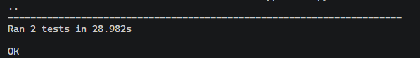
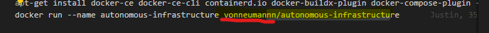

# Proyecto I - WikiSearch

## Tecnológico de Costa Rica

## Escuela de Ingeniería en Computación

## Bases de Datos II (IC 4302)

## Integrantes del grupo

- José Ricardo Cardona Quesada    | Carné: 2021022613
- Joctan Antonio Porras Esquivel  | Carné: 2021069671
- Justin Gilberto Acuña Barrantes | Carné: 2018093451

## Profesor

- Gerardo Nereo Campos Araya

## Segundo Semestre 2023

## Índice

- [Proyecto I - WikiSearch](#proyecto-i---wikisearch)
  - [Tecnológico de Costa Rica](#tecnológico-de-costa-rica)
  - [Escuela de Ingeniería en Computación](#escuela-de-ingeniería-en-computación)
  - [Bases de Datos II (IC 4302)](#bases-de-datos-ii-ic-4302)
  - [Integrantes del grupo](#integrantes-del-grupo)
  - [Profesor](#profesor)
  - [Segundo Semestre 2023](#segundo-semestre-2023)
  - [Índice](#índice)
  - [Infraestructura Propuesta para las Bases Utilizadas](#infraestructura-propuesta-para-las-bases-utilizadas)
    - [Autonomous Database](#autonomous-database)
      - [Tablas y datos importantes](#tablas-y-datos-importantes)
      - [Aclaración Importante del modelo](#aclaración-importante-del-modelo)
      - [Indices de Búsqueda](#indices-de-búsqueda)
        - [Autonomous DB](#autonomous-db)
        - [Search Index Mongo Atlas](#search-index-mongo-atlas)
      - [Stored Procedures Incluidos](#stored-procedures-incluidos)
        - [INSERT\_PAGE\_ALL](#insert_page_all)
        - [INSERT\_LINK](#insert_link)
        - [INSERT\_RESTRICTION](#insert_restriction)
      - [Dentro del Loader estas funciones se implementan en el siguiente código](#dentro-del-loader-estas-funciones-se-implementan-en-el-siguiente-código)
        - [INSERT\_FILE](#insert_file)
        - [GET\_FILENAMES](#get_filenames)
        - [INSERT\_SITE](#insert_site)
    - [MongoDb Mapping](#mongodb-mapping)
  - [Componentes del Proyecto](#componentes-del-proyecto)
    - [Object Storage](#object-storage)
    - [DataLoader](#dataloader)
        - [Puntos Extra](#puntos-extra)
        - [Duración del Código](#duración-del-código)
    - [Pruebas realizadas (UnitTests)](#pruebas-realizadas-unittests)
      - [Para los Unit Tests del Loader se realizaron](#para-los-unit-tests-del-loader-se-realizaron)
        - [test\_connect\_bucket()](#test_connect_bucket)
        - [test\_getFiles()](#test_getfiles)
        - [test\_get\_bucket\_file()](#test_get_bucket_file)
        - [Pruebas para Mongo](#pruebas-para-mongo)
        - [test\_MongodbConn()](#test_mongodbconn)
        - [test\_MongoGet()](#test_mongoget)
        - [Pruebas para Autonomous SQL](#pruebas-para-autonomous-sql)
        - [test\_oracle\_connection()](#test_oracle_connection)
        - [test\_oracleGet()](#test_oracleget)
        - [test\_parse\_text()](#test_parse_text)
        - [test\_get\_links()](#test_get_links)
      - [Aclaración](#aclaración)
    - [API](#api)
        - [Componentes:](#componentes)
    - [**Enpoints:**](#enpoints)
        - [Pruebas realizadas (UnitTests)](#pruebas-realizadas-unittests-1)
    - [Manual de Usuario](#manual-de-usuario)
    - [UI](#ui)
  - [Primer pantalla](#primer-pantalla)
  - [Pantalla de registro](#pantalla-de-registro)
  - [Pantalla Buscar](#pantalla-buscar)
    - [Página buscar con resultados](#página-buscar-con-resultados)
  - [Pantalla Documento completo](#pantalla-documento-completo)
  - [Final](#final)
  - [Recomendaciones](#recomendaciones)
  - [Conclusiones](#conclusiones)
  - [Información Importante y Consideraciones](#información-importante-y-consideraciones)
  - [Referencias](#referencias)

---
La presente es la documentación del proyecto 1 , que consistió en desarrollar un sistema para desplegar y procesar páginas de wikipedia a través de los Wikidumps XML. En este documento se detalla la funcionalidad de los componentes implementados, las pruebas unitarias realizadas, el manual de usuario para operar el sistema, y las conclusiones y recomendaciones para mejoras futuras. El objetivo es proporcionar una visión integral de la solución desarrollada y sus capacidades

---

## Infraestructura Propuesta para las Bases Utilizadas

### Autonomous Database

Para mantener una buena consistencia de los datos, para nuestra base SQL en oracle, el modelo propuesto es:

#### Tablas y datos importantes

- La **tabla File** almacena metadatos de los archivos de los Wiki Dumps, cuyos datos ya han sido procesados por el loader. Cada archivo tiene un ID único y un nombre. Esta tabla es relevante ya que a través de la información contenida aquí se puede revisar si ya los datos de una página fueron ingresados a la base anteriormente y así evitar que el Loader los ingrese por segunda vez.

- La **tabla Site** modela los datos del sitio, base de datos y lenguaje asociado a un File. Cada sitio tiene un ID, hace referencia al archivo de la tabla File a quien le pertenecen esos datos, y tiene campos para el nombre del sitio, base de datos, idioma, etc.

- La **tabla Page** contiene todas  las páginas de Wikipedia que se han procesado de los distintos archivos. Tiene campos como el ID, referencia al sitio al que pertenece, namespace, título, etc. Un atributo relevante es el de RATING, ya que este no se determina a partir de los wikidumps. Este atributo se modifica por medio del sistema de votación que se solicita para la UI, Este valor empieza como 0 y dependiendo de si recibe votaciones a favor o en contra aumenta o disminuye.

- La **tabla LastRevision** almacena los metadatos de la última revisión de cada página: ID, usuario que hizo la edición, texto completo de la revisión, bytes, fecha, etc. Hace referencia a la página de la cual es revisión.  Para extraer el texto de una página es necesario hacer un join entre una página y los datos que se encuentran en esta tabla.

- La **tabla Restriction** almacena información sobre las restricciones/protecciones que pueden tener las páginas. Cada restricción tiene un ID y un enlace con más detalles.  Es importante aclarar que una restricción puede aparecer en muchas páginas, y asimismo, una página puede tener muchas restricciones. Por lo tanto es necesario una tabla intermediaria.

- **PageXRestrictions** es una tabla intermedia para modelar la relación muchos a muchos entre páginas y restricciones. En esta tabla se contienen los ids de las distintas restricciones que existen y se asocian a páginas.

- La **tabla Link** almacena los distintos enlaces que aparecen en las páginas. Cada enlace tiene un ID y la URL del enlace. Al igual que con las restricciones, los links pueden pertenecer a muchas páginas y una página puede tener muchos links. Por lo tanto, también se ocupa una tabla intermedia.

- **PageXLink** es  la tabla intermedia para la relación muchos a muchos entre páginas y links.

#### Aclaración Importante del modelo

Para seguir los principios de normalización se tomó la decisión de  no almacenar datos que pueden calcularse a partir de otros datos en la base de datos. En este caso los datos que no se incluyeron en las tablas fueron:

- PageNumberLinks este se calcula usando la cantidad de links asociados a una página.

- PageHasRedirect se calcula revisando si el atributo Redirect es distinto de NULL en la tabla LastRevision.

#### Indices de Búsqueda

##### Autonomous DB

Lo que hacemos con esto es crear indices en cada campo donde queremos buscar, le asignamos un nombre, luego indicamos la columna que queremos indexar, al final las instrucciones INDEXTYPE IS CTXSYS.CONTEXT son debido a que el tipo CLOB en oracle no es indexable normalmente, pero con esto ya se pueden crear con normalidad.

##### Search Index Mongo Atlas

Para crear un indice de busqueda lo que debemos hacer es mapear cada uno de los campos que queremos usar para buscar. En caso de definir facets se hace con los tipos llamados: StringFacet, NumberFacet o DateFacet, por facilidad se utilizó la herramienta para crear indices de mongo, pero también se pueden definir mediante json.

#### Stored Procedures Incluidos

##### INSERT_PAGE_ALL

El objetivo de este procedimiento es agregar una instancia a la tabla página junto con los datos de su última revisión. Se reciben todos los datos para una entrada en la tabla page excepto el parámetro rating. El método está hecho para funcionar en el loader en conjunto con los métodos INSERT_RESTRICTION e  INSERT_LINK. Estos tres procedimientos se encargan de ingresar todos los datos de una página de wikipedia a la base de datos.

##### INSERT_LINK

Este método ingresa individualmente los datos de un Link a su tabla respectiva, aparte de esto conecta el link a una página en la tabla PageXLink. Esto para posteriormente poder obtener todos los links asociados a una página. Importante recalcar que el método está planeado para llamarse múltiples veces por cada link que tenga una página. Este ciclo de llamadas se implementa dentro del Loader.

##### INSERT_RESTRICTION

#### Dentro del Loader estas funciones se implementan en el siguiente código

##### INSERT_FILE

Este procedimiento simplemente recibe el nombre de un archivo que se va a procesar en la base de datos, esto para tener un registro de los datos que ya se han ingresado a la base. El método se utiliza dentro del Loader para verificar si se ocupa procesar un archivo en el bucket e ingresarlo a las base.

##### GET_FILENAMES

Este método ingresa a la tabla File y revisa todos los nombres de los archivos que se han procesado en la base y los regresa en forma de un cursor. Una vez en el loader este cursor se puede procesar y convertir en una lista con los nombres.

##### INSERT_SITE

Este método inserta los datos del sitio que aparece en un archivo específico de la tabla File, por lo tanto de parámetro se recibe el Id del File al que pertenece, junto con los datos que se quieren ingresar.

### MongoDb Mapping

[//]: # (Poner una Imagen del Mapping en Mongo, Porfa alguien que explique esto, <== ayuden a este pobre hombre José)

----

## Componentes del Proyecto

----
### Object Storage

Para el componente Object Storage las indicaciones del proyecto dicen que se deben de subir 3 archivos para cada procesamiento de las páginas en el loader, estos son:

- enwiki-latest-pages-articles-multistream*.xml-p\*p\*.bz2

- enwikilatest-abstract*.xml.gz

- enwiki-latest-pages-articles-multistream-index*.txt-p\*p\*.bz2

También se menciona que estos archivos serán manualmente descargados, descomprimidos y subidos dentro de Object Storage.
Para el proyecto implementamos esto de forma mucho más eficiente. Las mejoras que hicimos se dividen en dos:

- #### **No hace falta descomprimir los datos primero para subirlos:**

Para evitar gastar más espacio del necesario en el ambiente local donde se suben los datos y para que sea más rápido el proceso de subir los datos al bucket, optamos por implementar dentro del loader una función que recibe un archivo comprimido tipo bz2 y fácilmente extrae sus datos. Esto evita tener que descomprimir los datos antes de subirlos al bucket.

- #### **Solo ocupamos un archivo para todos los datos**

Las instrucciones del proyecto indican que para obtener los atributos PageWikipediaLink y PageLinks debíamos utilizar los archivos "enwiki-latest-abstract*.xml.gz" o "enwiki-latest-pages-articlesmultistream-index*.txt-pp.bz2".
Sin embargo, nosotros logramos obtener estos datos a través del archivo "enwiki-latest-pages-articlesmultistream" utilizando la librería mwParserfromhell para parsear el wikitext y extraer estos elementos. Esto es posible gracias a que el wikitext de cada página de Wikipedia contiene los links hacia otras páginas de Wikipedia, y por lo tanto parseando solo los links se puede armar una lista con todos estos.

Para esto nos basamos en los ejemplos de la documentación de Mwparser fromhell que se encuentra en: https://github.com/earwig/mwparserfromhell y  https://mwparserfromhell.readthedocs.io/en/latest/api/mwparserfromhell.html#id1

Por lo tanto para el funcionamiento correcto de todo el programa, solamente es necesario descargar el archivo comprimido  enwiki-latest-pages-articlesmultistream. para las páginas que se quieran procesar y se sube directamente al bucket, sin tener que descomprimir o subir otros archivos.

---

### DataLoader

Este componente está 100% funcional de acuerdo con lo solicitado en el proyecto, el código esta 100% documentado y se hicieron los UnitTests respectivos.

Algunas aclaraciones importantes sobre este elemento son:

##### Puntos Extra

Se implementaron los Puntos Extra (Generar texto limpio de Wikipedia) usando MwParser from Hell. Para esta sección decidimos agregar un campo adicional a la tabla page en el Modelo SQL y en el mapping de Mongo que es correspondiente al texto limpio. De esta forma podemos acceder tanto al texto limpio como al Wikitext.

El código donde se parsea el texto es:

Por lo tanto el loader cada vez que procese una página llamará este método específico y guarda el texto limpio asociado a esa pagina.

##### Duración del Código 

La duración del código para procesar cada una de las páginas tiene una duración muy corta, sin embargo, debido a que cada documento que se va a procesar tiene miles de páginas se puede durar bastante procesando los archivos. **Por lo tanto, para comodidad del usuario, el codigo para procesar un archivo contiene una línea de código donde se puede definir cuantos archivos se quiere procesar** 

La siguiente linea se presenta en la función `process_file` en la siguiente sección:

Se puede definir cont == (la cantidad que uno desee de articulos a procesar)

Este código va a estar comentado en el documento que se va a subir, entonces para habilitarlo, antes de habilitar la infrastuctura se puede quitar los hashtags a la izquierda e ingresar el número que se quiera procesar. Esta función es completamente opcional
### Pruebas realizadas (UnitTests)

#### Para los Unit Tests del Loader se realizaron 

Primero se probaron las funciones del Loader para conectar con el bucket de OCI, obtener los archivos en el bucket, descargar uno de estos archivos y descomprimirlo. Si bien estos tests demuestran las funcionalidades del bucket **SOLO SIRVEN SI LA BASE ESTA CORRIENDO** y por ende se usaron para probar funcionalidades inicialmente pero actualmente solo están comentados

Estos Unit Tests son los siguientes:

##### test_connect_bucket()

En el primer test se verifica si es posible establecer una conexción con el bucket de autonomous usando la configuración alambrada desde el main. Se indica que se espera obtener un cliente de Object Storage. Luego se compara el tipo de dato que regresa la función de conexión con el cliente.

Si el tipo de dato que regresa la función es un cliente y no es None se pasa el test

##### test_getFiles()

En este test, una vez se probo la conexión al bucket, se prueba obteniendo todos los archivos que existen dentro del el. Si el resultado obtenido de esta operación es una lista se considera completo el test.

No se reviso si el tipo de dato adentro eran archivos realmente porque puede estar vacio el bucket.

##### test_get_bucket_file()

Este experimento prueba obteniendo los nombres de todos los objetos en el bucket, debido a que ocupa los dos métodos anteriores se prueba hasta que se pasaron los tests de los dos anteriores.

Este método prueba estableciendo una conexión con el bucket, obteniendo la lista de archivos y en base a esto pueden pasar dos escenarios:

1. Si hay datos en el bucket se prueba descargando el promer archivo de esos datos y que si se descargue correctamente
2. Si no hay datos en el bucket no se prueba descargar y simplemente se pasa el test

Para pasar el test se debe revisar que se regrese el nombre del archivo descargado o que se ignore en caso de ser vacío.

Probando estos 3 métodos sobre las funciones del Loader:

---
Luego se probaron métodos para probar si los métodos de conexión e inserción en las bases de datos funcionaban correctamente:

##### Pruebas para Mongo

Para Mongo se hacen dos pruebas:

##### test_MongodbConn()

Este test se asegura que el método para conectar con Mongo Atlas sea completamente funcional, obtiene la conexión y se asegura que el método no regrese None.

Luego revisa que en la conexión a Mongo exista la base de datos Wikipedia dentro del cluster al que se conecto. Esto es esencial ya que sin base de datos los inserts no van a servir.

Si se logra se considera que se paso el test.
##### test_MongoGet()

Este método prueba obteniendo los nombres de los archivos que se han registrado en la base MongoDb. Es una operación de tipo GET, lo que se espera es verificar si el método regresa una lista ya sea vacía o con nombres de archivos. Si no regresa una lista no esta funcionando adecuadamente.

Luego de probar el Get se prueba insertando un dato nuevo a la colección y luego volviendo a llamar al metodo de get para verificar si realmente se agrego un archivo nuevo. Una vez se verifica que si se agrego se elimina el dato de prueba y se considera el test completado.

---

##### Pruebas para Autonomous SQL

Al igual que con mongo, en Autonomous se probaron los métodos del loader para conectar e insertar datos dentro de la base. Sin embargo, es importante notar que **ESTOS MÉTODOS SOLO SIRVEN SI LA BASE ESTA CORRIENDO**, por lo tanto están comentados dentro del dockerfile para evitar errores porque no existe la base. Estos tests fueron:

##### test_oracle_connection()

Esta prueba verifica si se puede establecer conexión con Oracle Cloud Infrastructre y entrar a la base Autonomous.

El método es exitoso si la conexión es distinta de None. Despúes de verificar esto el test se considera completado.

##### test_oracleGet()

Esta prueba, similar a la de Mongo, se conecta a la base de datos y obtiene los nombres de todos los archivos que hasta el momento han sido procesados. Para que esta parte sea exitosa el método debe de regresar un objeto de tipo lista, ya sea vacía o con componentes.

Una vez hecho esto se prueba el método para ingresar un archivo a la base de datos y se verifica que al obtener nuevamente la lista de archivos se haya agregado uno.

Si esto es exitoso se considera la prueba como terminada.

Los resultados al ejecutar estas pruebas son:

---

Después se prueba la función para comparar las listas de archivos en cada base y verificar si coinciden con los archivos que están almacenados en el bucket. Si en el bucket hay un archivo que no sale en alguna de las bases se procede a retornar el nombre del archivo y la base donde se desea ingresar.

Para este método, se hacen distintas pruebas una donde SQL no tenga el archivo, una donde Mongo no tenga el archivo, una donde ambos no lo tengan y una donde ambos si lo tengan.

- Cuando SQL no tiene el archivo se espera recibir el nombre y el string 'SQL'

- Cuando Mongo no tiene el archivo se espera recibir el nombre y el string 'MONGO'

- Cuando ninguna lo tiene se regresa el nombre y se espera el string 'AMBOS'

- Cuando ambos tienen el archivo se espera obtener de output None

Una vez que se comprueban todos los casos exitosamente se considera el unittest como completado

El resultado de este test es:

---
Finalmente, se prueban las funciones para parsear wikitext y obtener links

##### test_parse_text()

Esta función contiene un wikitext de ejemplo y texto limpio, este texto limpio representa el output esperado después de parsear el wikitext para quitarle todos los elementos adicionales.

El test funciona si al parsear el wikitext si se obtiene el texto esperado. Una vez revisado esto se considera el test como completado

##### test_get_links()

Similar a la pasada, esta función tiene un wikitext ejemplo que contiene lins, también se tiene una lista con los links que se espera que el método get_lins regrese en base a ese texto.

Si los links obtenidos al ejecutar el método son iguales a los links esperados, se considera completado el Unittest

Corriendo estas pruebas se obtiene:

---

#### Aclaración

Hubo algunos métodos en el código para el que no se hicieron unit tests ya que son una combinación de los métodos que si se probaron a través de las pruebas. Además el resto de funciones que no se pudieron hacer Unittests son aquellas en las que se requiere conexión con la base de datos SQL, es decir, requieren que primero se genere la infrastructura SQL para correrlas, sin embargo, cuando se cree la imagen de docker con estos tests no se espera que esta exista aún.

El resultado al correr todas las pruebas  en un escenario donde la base si este corriendo es:

Si bien se tiran advertencias, estas no afectan el desempeño o resultados de las pruebas y se pueden ignorar. Todas las pruebas son aprobadas cuando la base de datos esta corriendo.

---

### API

La API se completó en un en un 90% la parte no implementada es la de los facets, estos si se obtienen cuando se realiza la búsqueda con mongo.

##### Componentes:
CORS(app): Cross-origin resource sharing, es un mecanismo que permite que se puedan solicitar recursos restringidos. Esto nos ayuda para poder enviar y solicitar datos desde la API y la UI
Funciones:

- **dbOracle_connection():** Con este método nos conectamos a la base de datos de oracle mediante un user, password y un string que contiene los datos de conexión.

- **dbMongo_connection():** Método para conectar con la base de datos de mongo, mediante el string que nos da mongo.

- **dbLogs(title, timeStamp):** Esta función se encarga de insertar logs en una tabla NoSQL, con un mensaje y la hora de la consulta.

- **firebaseConnection():** Función para conectarse a firebase y retorna la conexión.

### **Enpoints:**

**/register:** Es un post que pasa los datos necesarios en tipo json para registrarse en firebase y retorna un mensaje indicando que el registro fue exitoso.

**/login:** Este es un post que recibe un email y contraseña, con esto se busca si existe en firebase en caso de ser así entonces comprueba si la contraseña es correcta y devuelta un mensaje de login exitoso.

**/search:** En este endpoint GET se tienen parámetros en la URL,  stringBusqueda, este es el que contiene el string que queremos buscar. tipoRecurso, contiene en cuál base de datos queremos buscar(1 para autonomous, 2 para mongo), luego de que se extraen los parámetros se comprueba el tipo de BD, si es autonomous, se define una consulta SQL, esta consulta hace un SELECT para obtener el título y los datos que ocupamos, gracias a los índices creados podemos usar la instrucción CONTAINS de oracle sql, inmediatamente después se ejecuta la consulta y se guardan los datos para ser retornados en formato JSON, y realizar su respectiva inserción a la tabla de logs. Al final cierra la conexión.

Cuando la base es Mongo Atlas se obtiene el stringBusqueda, se llama a la función para conectarse a mongo, y se define la colección con la que vamos a trabajar, luego se define la consulta para usar con el método aggregate() de mongo, la consulta contiene las siguientes partes: primero, seleccionamos el índice creado de los campos donde vamos a buscar, luego definimos las rutas donde vamos a buscar así como la palabra que queremos buscar, además de utilizar la funcionalidad que tiene mongo para realizar highlight de los resultados, por último definimos los datos que queremos que muestre la consulta.
La segunda consulta define los los buckets(como los tags de cada facet) y límites(rangos) que va a tener cada facet, además de esto obtenemos los facets con su bucket, específicamente para la búsqueda. Luego de esto utilizamos la función aggregate() para agregar en un stage en mongo, luego se retorna el los resultados de la búsqueda y los facets correspondientes.

**/document:** Es un GET obtenemos los parámetros title, tipoRecurso. Si es autonomousDB, definimos una consulta sql para obtener el documento buscando por title, se ejecuta esta consulta la cual devuelve el Texto limpio de, el link a wikipedia y el Rating, luego retorna el documento con formato json. Además de insertar en la tabla logs.

En caso de mongo atlas, primero encuentra según el title recibido como parámetro, luego obtiene el texto normalizado, seguido del link a wikipedia así como el rating actual de la página. Si encuentra el documento lo retorna como un tipo json, si no muestra un mensaje de error e inserta en la tabla de logs.

**/rating:** Este endpoint va a realizar un GET que tiene como parametros, title, tipoRecurso, rating. Si es autonomous entonces realiza una consulta sql que actualiza el campo rating de la tabla Page, para sumar o restar uno dependiendo del contenido de rating, luego retorna un mensaje si la tabla se actualizó.

Para mongo atlas, realiza un update en la colección según el título para hacer un incremento o decremento del rating, y lanza un mensaje.

##### Pruebas realizadas (UnitTests)

Para cada prueba se construye una url con el endpoint necesario además de agregarle los parámetros necesarios. Las pruebas para autonomous no son posibles porque la infraestructura se crea después de los unitests

**test_login:** Realiza la comprobación de que se realiza el login correctamente, toma los datos dados al principio. Es una consulta del tipo POST

**test_register:** Ingresa datos de prueba para comprobar que se realizó el registro correctamente.

**test_searchOracle:** 

Busca en la base de datos autonomous, definimos lo que queremos buscar al principio del programa.

**test_searchMongo:** Busca en mongo atlas, con los datos que definimos.

Resultado

**test_documentOracle:** Con esto se prueba que se encuentre el documento con el título 
seleccionado en la base de datos autonomous.

**test_documentMongo:** Se muestra el documento con el título seleccionado según el título.

Resultado

**test_ratingOracle:** Se prueba que la actualización del rating en autonomous sea correcta.

**test_ratingMongo:** Se prueba que la actualización del rating en mongo sea correcta.

Resultados

---
### Manual de Usuario

A continuación se presentan las instrucciones para ejecutar nuestro programa desde 0. Lo primero será descargar el folder y colocarlo descomprimido en alguna carpeta que sea de comodidad para acceso en el futuro.

Ahora desde una terminal de linux en la herramienta que se desee se navega a la carpeta de P1 para el folder del proyecto. En el caso de esta guía utilizamos visual studio, pero en caso de errores a la hora de manejar las ssh recomendamos utilizar `MobaXTerm` para la terminal.

Para abrir la terminal en la carpeta se puede hacer click derecho en la carpeta y se selecciona la opción de abrir con Visual Studio o MobaXTerm. También se puede navegar usando el comando Cd para llegar a la dirección deseada. Es muy importante que si se hace a punta de CD recordar que las direcciones deben contener /mnt/d/ al inicio debido a que estamos trabajando con un sistema linux.

Una vez en la terminal se verá lo siguiente:

En esta terminal se van a poder ejecutar distintos comandos dependiendo de lo que se desee, este código esta hecho para correr imagenes de docker ya pre fabricadas por el equipo, sin embargo, si se cambiara algo y se quieren subir las imagenes alteradas se debe:

Cambiar el archivo DockerImages.sh que se encuentra en la carpeta de automatización dentro de P1.
En específico se debe cambiar el nombre del usuario por aquel con el que se hizo login y en el que se quieren subir las imágenes. Ej:

Todos esos nombres se deben cambiar por el nombre correcto del usuario de docker.

Una vez hecho esto se debe buscar la carpeta llamada templates y ahi dentro habrán tres archivos que se llamarán vm#.sh Para cada uno de estos archivos se usa una imagen de docker, aqui también será necesario cambiar el nombre por el nuevo deseado.

Ahora, una vez estan configuradas lás imagenes de docker y ya estan listos los scripts para las máquinas virtuales se vana a ejecutar los siguientes comandos:

`cd automatizacion`

Si se quieren crear las imágenes (Opcional):

`dos2unix dockerImages.sh`
`./dockerImages.sh`

Luego se pasa a crear la verdadera infrastructura para el proyecto, para esto en el mismo folder simplemente se ejecuta lo siguiente:

`dos2unix terraform.sh`
`./terraform.sh`

Hecho esto al usuario le debería aparecer lo siguiente:

Esto es una lista de lo que se va a realizar junto con cambios y demás aspectos, si el usuario quiere proceder debe escribir la palabra `yes`. Una vez hecho esto es cuestión de esperar que el comando termine de ejecutar.

Una vez ejecutado, la infrastructura en la cuenta de Oracle Cloud Infrastructre se creo. Del lado del usuario esta cuenta es innaccesible, sin embargo es importante recalcar que los administradores de la base de datos cada cierto tiempo o de acuerdo a solicitudes del profesor van a ingresar a la página de Wikidumps, buscar un archivo comprimido de tipo bz2 con un nombre similar a:  **enwiki-latest-pages-articles-multistream*.xml-p\*p\*.bz**

Una vez los administradores suben este documento el componente loader en el fondo comienza a procesarlo y a subir archivos a las bases de datos. Después ya los datos conforme son procesados el cliente los puede ver en el UI.

Para conectar con el UI

Una vez el terraform apply se haya ejecutado, nos dará una dirección ip para poder conectarnos por SSH, esta misma dirección la usamos para llamar a la UI mediante la dirección: <dirección>:8080/. Ya con esto tendremos accesso, a las funcionalidades.

### UI

## Primer pantalla

En la primer pantalla de la aplicación se observará recuadro en el centro con la leyenda "Login WikiSearch". En esta parte se deben de poner las credenciales de acceso a para poder ingresar a realizar las búsquedas.

En caso de que se intente entrar con las credenciales vacias o alguna de ellas vacia, la aplicación le mostrará los errores correspondientes:

Si no se tiene una cuenta y se intenta entrar con credenciales no válidas, se obtendrá el mensaje correspondientes:

Mensaje de usuario no encontrado:

**Nota:** Al tocar el ojo que está al lado del espacio de la contraseña se podrá ver lo que se escribió y al tocarlo de nuevo volverá a estar oculto:

**Importante:** Cuando no se tiene una cuenta se debe ir a la parte de abajo donde dice "Registrate aquí" en azul. Al hacer clic sobre este texto azul se redirigirá a lapantalla de registro que será explicada adelante.

Cuando el usuario y contraseña son válidos, la aplicación lo redirigirá a la pantalla de búsqueda que se explicará más adelante.

## Pantalla de registro

En esta pantalla se tendrá lo siguiente una vez que se entre:

Una vez en esta pantalla se podrá realizar el registro al llenar los datos que se solicitan, pero si un dato está vacio se obtendrá el error correspondiente:

Una vez que se llenen los datos de manera correcta se debe de ver algo así:

Una vez todo esté listo se debe dar clic sobre el boton que dice "Confirmar", al tener toda la información y dar clic, se recibirá el siguiente mensaje:

Al dar clic sobre Aceptar, será redireccionado a la pantalla de Login.

## Pantalla Buscar

En esta pantalla se tendrá lo siguiente una vez que se entre:

En esta pantalla se cuenta con los siguientes elementos:

- **Barra de búsqueda:** En ella se debe escribir lo que se desea buscar.
- **Botón de Buscar:** Se usa para realizar la búsqueda deseada, si se presiona la tecla ENTER/INTRO se puede obtener el mismo resultado.
- **Botones de tipo de base de datos:** Selecciona la base de datos en la que se quiere realizar la búsqueda.

Si se realiza una búsqueda con la barra vacía se mostrará el siguiente error:

Para seguir buscando solo se presiona aceptar.

Si se realiza una búsqueda y no hay se encuentran coincidencias con lo que se está buscando se mostrará el siguiente mensaje:

### Página buscar con resultados

Cuando la búsqueda si encuentra algo, se mostrará de la siguiente manera:

En esta parte tendremos la columna izquierda la cual corresponde a los facets de cada documento. Sin embargo **la funcionalidad de buscar mediante ellos será implementada en futuras versiones de la aplicación**.

La segunda parte es la de los documentos, en esta parte estarán todos los documentos/articulos encontrados, en caso de encontrar muchos articulos, se podrá hacer scroll hasta el final.

Una vez se encuentre el articulo deseado, se puede dar clic sobre el titulo del documento (texto en azul). Esto lo llevará a la siguiente pantalla la cual es la del documento completo.

## Pantalla Documento completo

Para mostrar esta pantalla usaremos la palabra "Anarchism", la pantalla se mostrará de la siguiente manera:

## Final

Finalmente, si se quisiera borrar la infrastructura, en la misma terminal que se han ejecutado los comandos pasados. Se va a la carpeta de automatización y se ejecutan los siguientes comandos:

`dos2unix destroy.sh`

`./destroy.sh`

Esta sería la guía para el uso de la página WikiSearch. Cualquier error o inconveniente, favor comunicarlo a cualquiera de los correos:

- [joctan@estudiantec.cr](mailto:joctan@estudiantec.cr)
- [justingilberto@estudiantec.cr](mailto:justingilberto@estudiantec.cr)
- [jcardonar@estudiantec.cr](mailto:jcardonar@estudiantec.cr)

## Recomendaciones

1. Siempre documentar apropiadamente el código con comentarios explicativos y hacer unit tests que validen cada componente. De esta forma se facilita enormemente la lectura y depuración del código, tanto para uno mismo como para otros miembros del equipo

2. En lugar de implementar las bases de datos de forma local usando tecnologías como Kubernetes o Docker Compose, recomendamos crear  la infraestructura a la nube, en una plataforma como Oracle Cloud Infrastructure. Al utilizar recursos en la nube como instancias o máquinas virtuales, no es necesario contar con dispositivos locales poderosos o con mucho almacenamiento para los ejecutables o la base de datos.

3. Siempre usar github y guardar versiones periódicamente, esto para evitar perder datos o recuperar código funcional en caso de que algún componente deje de funcionar.

4. Para cualquier persona que quiera implementar Oracle Autonomous Database, recomendamos dedicarle tiempo a aprender la sintaxis y estructuras de PL/SQL. Inicialmente, nosotros tuvimos dificultades con este lenguaje, especialmente con tipos de datos como CLOB. y VARRAY.

5. Estudiar ejemplos prácticos de PL/SQL y revisar documentación de referencia como la [guía oficial de Oracle](https://docs.oracle.com/en/database/oracle/oracle-database/19/lnpls/index.html) es de gran ayuda para dominar este lenguaje.

6. La comunicación entre el frontend y el backend puede resultar engorrosa en algunos casos. Específicamente, la integración entre React y Flask utilizando sus funciones nativas para HTTP requests puede volverse complicada.
Para facilitar esta integración, recomendamos utilizar la biblioteca Axios de JavaScript. Para aprender sintaxis y uso, se puede hacer desde su [página oficial](https://axios-http.com/docs/intro).

7. Para procesar los XML dumps de Wikipedia recomendamos usar **mwxml** y **mwparserfromhell**. Estas dos bibliotecas permiten obtener fácilmente la información de cada página dentro del dump, sin tener que lidiar directamente con la complejidad del XML o el wikitext.

8. Se recomienda establecer una cuenta de Oracle para todo el equipo desde el inicio del proyecto. Todos los miembros del equipo deben conocer y utilizar estas credenciales compartidas. Esto evita inconsistencias y problemas de acceso más adelante.

9. Distribuir claramente las responsabilidades de cada miembro del equipo. Asignar tareas específicas de desarrollo de base de datos, pruebas, documentación, etc. a diferentes personas. Tener claro quien se encarga de qué.

10. Recomendamos atomizar las funciones dentro de los componentes, descomponiéndolas en operaciones simples y con propósitos específicos. Evitar funciones muy complejas o que realicen múltiples tareas. Esto es para que luego si sucede algún error dentro de una función no sea tan confuso el proceso de debugging y se pueda entender el problema más fácilmente

11. Desarrollar y probar componentes individuales del código sin Docker inicialmente. Una vez que cada módulo funcione correctamente de forma aislada, entonces proceder a dockerizar las aplicaciones.

## Conclusiones

1. Oracle Db, a pesar de ser una herramienta muy sólida para cloud computing, no es la más sencilla de comprender para principiantes, especialmente en aspectos como la implementación de protocolos de seguridad, el manejo de llaves y restricciones de IP, entre otros. Es necesario tener en cuenta muchos factores para usarla correctamente. Sobre todo cuando se trata de interactuar con la base de datos y su particular lenguaje SQL, ya que en este lenguaje hay tipos especiales como CLOB, VARRAY, etc.

2. Para crear la infraestructura de una base de datos o sistema, Terraform es una herramienta sumamente útil. La provisión automática de bases de datos a través de OCI y Terraform convirtió un proceso complejo, donde cada estructura como la DB, los buckets, las instancias, etc. eran creadas manualmente, en algo simple y rápido. Esto nos permitió desplegar instancias rápidamente sin tener que administrar toda la infraestructura.

3. Durante la ejecución del proyecto aprendimos que los buckets de Oracle Cloud Infrastructure son sumamente útiles y versátiles para el almacenamiento y acceso a archivos en la nube. Esto ya que permiten cargar fácilmente documentos de todo tipo y descargarlos cuando sea necesario desde cualquier dispositivo o aplicación, evitando tener que almacenar localmente grandes volúmenes de datos.

4. Es importante comunicarse entre las partes de UI, API y Loader debido a que se deben establecer estándares en los datos que se van a recibir/enviar para poder trabajar de forma descentralizada y no ser tan dependientes, sin embargo, con algún cambio que surja en el formato se debe comunicar a las partes involucradas para hacer las correcciones necesarias y poder tener todo a tiempo.

5. Tener datos de prueba, dummies o tontos hace más sencillo y rápido el desarrollo del UI debido a que se tiene una base de donde partir para poder hacer las funciones y todo lo necesario para recibir los datos una vez que ya están los reales.

6. Algunas bases de datos hacen que las tareas de crear, obtener, modificar datos, y obtener conexiones a las bases de datos sean más sencillas, por ejemplo Mongo Atlas, Firebase facilitan las conexiones ya que tienen código generado para varios lenguajes. Además sus estructuras son mucho más intuitivas al ser NoSQL. Caso contrario con Autonomous DB.

7. Las máquinas virtuales en la nube son herramientas increíblemente poderosas en comparación con soluciones locales como Docker. Anteriormente, utilizamos Docker y almacenamos todos los datos localmente, lo cual resultaba muy pesado y consumía grandes cantidades de recursos en nuestros dispositivos. Ahora con VMs se resolvieron estos problemas al permitirnos crear entornos aislados y escalables bajo demanda

8. MongoDB Atlas es una base de datos sumamente potente implementa funciones realmente útiles como los highlights, facets, entre otras cosas que nos gustaria investigar en el futuro.

9. Las bases de datos NoSQL como lo es Mongo Atlas, resultan sumamente intuitivas para el desarrollo, ya que no tenemos toda la complejidad que posee el tratar de entender un modelo y todas las relaciones entre tablas que tienen las bases de datos SQL.

10. El manejo de datos mediante JSON resulta muy fácil de usar para mover datos de BD hasta el API y luego a la UI, al ser estandarizado, en todas las tecnologías que se usaron en el proyecto fue muy sencillo de manejar y todas tenian soporte para el archivo.

## Información Importante y Consideraciones

[//]: # (PONER AQUI COSAS DE SUS COMPONENTES QUE NO SIRVEN O CONSIDERACIONES IMPORTANTES PARA EJECUTAR EL PROYECTO)

La infraestructura de la base Mongo Atlas no se crea automáticamente, es decir,  el cluster, la base de datos y las colecciones junto con sus índices se generan manualmente y no por medio del terraform o una máquina virtual. Por lo tanto si se quisiera implementar esto con un Cluster distinto al actual, en el código sería necesario hacerlo manualmente y luego cambiar.

## Referencias

> Oracle database database PL/SQL language reference, 19c. (2019, enero 14). Oracle Help Center. https://docs.oracle.com/en/database/oracle/oracle-database/19/lnpls/index.html
>
>Getting Started | Axios Docs. (s.f.). Axios. https://axios-http.com/docs/intro
>
>Kurtovic, B. (n.d.). mwparserfromhell: A Python parser for MediaWiki wikicode [Computer software]. GitHub. https://github.com/earwig/mwparserfromhell
>
>The Tor Project, Inc. (n.d.). API Reference — mwparserfromhell 0.6.4 documentation. Mwparserfromhell.ReadtheDocs.Io. Retrieved February 23, 2023, from https://mwparserfromhell.readthedocs.io/en/latest/api/mwparserfromhell.html#id1

