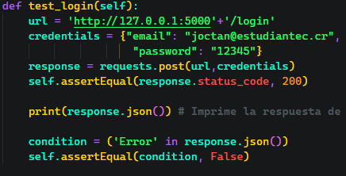
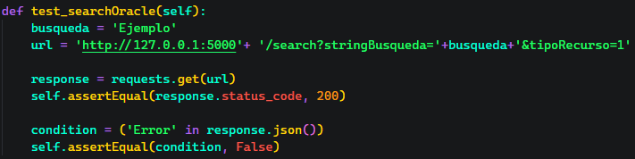
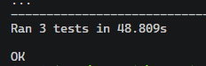
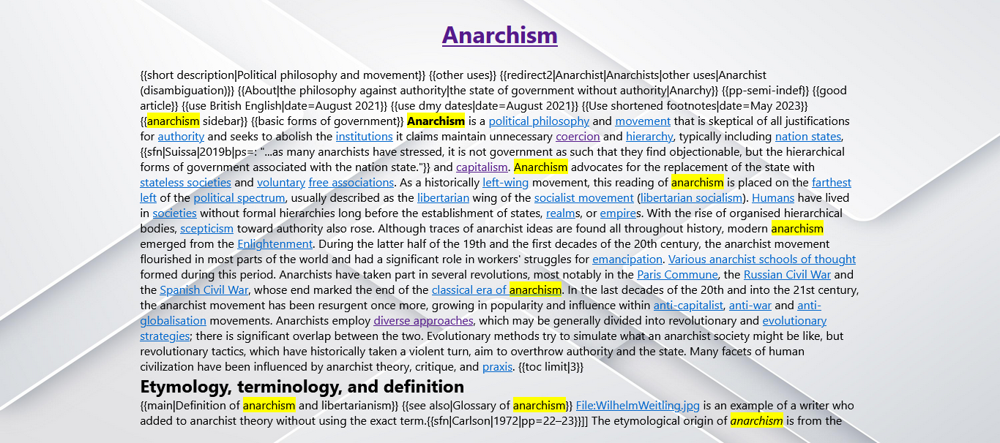

# Documentación WEB

## Primer pantalla

En la primer pantalla de la aplicación se observará recuadro en el centro con la leyenda "Login WikiSearch". En esta parte se deben de poner las credenciales de acceso a para poder ingresar a realizar las búsquedas.

En caso de que se intente entrar con las credenciales vacias o alguna de ellas vacia, la aplicación le mostrará los errores correspondientes:

Si no se tiene una cuenta y se intenta entrar con credenciales no válidas, se obtendrá el mensaje correspondientes:

Mensaje de usuario no encontrado:

**Nota:** Al tocar el ojo que está al lado del espacio de la contraseña se podrá ver lo que se escribió y al tocarlo de nuevo volverá a estar oculto:

**Importante:** Cuando no se tiene una cuenta se debe ir a la parte de abajo donde dice "Registrate aquí" en azul. Al hacer clic sobre este texto azul se redirigirá a lapantalla de registro que será explicada adelante.

Cuando el usuario y contraseña son válidos, la aplicación lo redirigirá a la pantalla de búsqueda que se explicará más adelante.

## Pantalla de registro

En esta pantalla se tendrá lo siguiente una vez que se entre:

Una vez en esta pantalla se podrá realizar el registro al llenar los datos que se solicitan, pero si un dato está vacio se obtendrá el error correspondiente:

Una vez que se llenen los datos de manera correcta se debe de ver algo así:

Una vez todo esté listo se debe dar clic sobre el boton que dice "Confirmar", al tener toda la información y dar clic, se recibirá el siguiente mensaje:

Al dar clic sobre Aceptar, será redireccionado a la pantalla de Login.

## Pantalla Buscar

En esta pantalla se tendrá lo siguiente una vez que se entre:

En esta pantalla se cuenta con los siguientes elementos:

- **Barra de búsqueda:** En ella se debe escribir lo que se desea buscar.
- **Botón de Buscar:** Se usa para realizar la búsqueda deseada, si se presiona la tecla ENTER/INTRO se puede obtener el mismo resultado.
- **Botones de tipo de base de datos:** Selecciona la base de datos en la que se quiere realizar la búsqueda.

Si se realiza una búsqueda con la barra vacía se mostrará el siguiente error:

Para seguir buscando solo se presiona aceptar.

Si se realiza una búsqueda y no hay se encuentran coincidencias con lo que se está buscando se mostrará el siguiente mensaje:

### Página buscar con resultados

Cuando la búsqueda si encuentra algo, se mostrará de la siguiente manera:

En esta parte tendremos la columna izquierda la cual corresponde a los facets de cada documento. Sin embargo **la funcionalidad de buscar mediante ellos será implementada en futuras versiones de la aplicación**.

La segunda parte es la de los documentos, en esta parte estarán todos los documentos/articulos encontrados, en caso de encontrar muchos articulos, se podrá hacer scroll hasta el final.

Una vez se encuentre el articulo deseado, se puede dar clic sobre el titulo del documento (texto en azul). Esto lo llevará a la siguiente pantalla la cual es la del documento completo.

## Pantalla Documento completo

Para mostrar esta pantalla usaremos la palabra "Anarchism", la pantalla se mostrará de la siguiente manera:

## Final

Esta sería la guía para el uso de la página WikiSearch. Cualquier error o inconveniente, favor comunirlo a cualquiera de los correos:

- [joctan@estudiantec.cr](mailto:joctan@estudiantec.cr)
- [justingilberto@estudiantec.cr](mailto:justingilberto@estudiantec.cr)
- [jcardonar@estudiantec.cr](mailto:jcardonar@estudiantec.cr)
